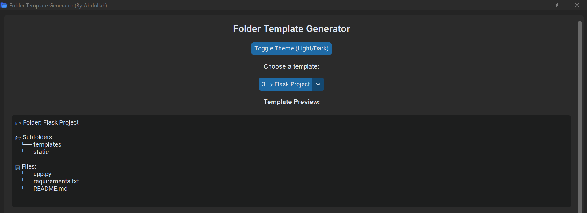
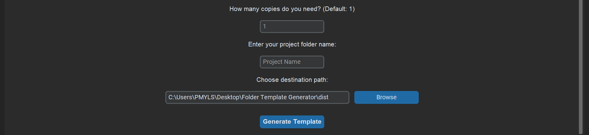

# Folder Template Generator


A user-friendly desktop application that creates predefined folder structures and files for various project types. Built with Python and CustomTkinter for a modern, cross-platform GUI experience.

## ✨ Features

- **Modern UI**: Clean, responsive interface with light/dark theme support
- **Multiple Templates**: Predefined folder structures for different project types
- **Batch Creation**: Generate multiple copies of the same template
- **Custom Naming**: Rename project folders to match your needs
- **Path Selection**: Choose any destination directory for your projects
- **Live Preview**: See template structure before creation
- **Cross-Platform**: Works on Windows, macOS, and Linux

## 🖼️ Screenshots

### Main Interface with Template Preview


*The main window showing template selection, live preview of folder structure, and all customization options*

### Template Selection Dropdown


*Available project templates including Python, Web, Flask, Data Science, Node.js, and React projects*

### Input Fields and Generation


*Customization options for project copies, naming, destination path, and the generate button*
## 🚀 Getting Started

### Prerequisites

- Python 3.6 or higher
- pip (Python package installer)

### Installation

1. **Clone the repository**
   ```bash
   git clone https://github.com/yourusername/folder-template-generator.git
   cd folder-template-generator
   ```

2. **Install dependencies**
   ```bash
   pip install customtkinter
   ```

3. **Prepare template files**
   - Ensure `templates.json` is in the same directory as the main script
   - Add `icon.ico` (Windows) and/or `icon.png` (other platforms) for the application icon

4. **Run the application**
   ```bash
   python main.py
   ```

## 📁 Project Structure

```
folder-template-generator/
├── main.py                 # Main application file
├── templates.json          # Template definitions
├── icon.ico               # Windows application icon
├── icon.png               # Cross-platform application icon
├── README.md              # This file
└── requirements.txt       # Python dependencies
```

## 🎯 Usage

### Basic Usage

1. **Launch the application**
   - Run `python main.py` from the project directory

2. **Select a template**
   - Choose from the dropdown menu of available templates
   - View the preview to see the folder structure and files

3. **Customize your project**
   - Enter the number of copies needed (default: 1)
   - Specify a custom project folder name
   - Select the destination directory

4. **Generate**
   - Click "Generate Template" to create your project structure

### Template Format

Templates are defined in `templates.json` with the following structure:

```json
{
  "1": {
    "folder": "Web Development Project",
    "subfolders": [
      "css",
      "js",
      "images",
      "assets"
    ],
    "files": {
      "index.html": "<!DOCTYPE html>\n<html>\n<head>\n    <title>New Project</title>\n</head>\n<body>\n    <h1>Hello World!</h1>\n</body>\n</html>",
      "style.css": "/* Main styles */\nbody {\n    font-family: Arial, sans-serif;\n}",
      "script.js": "// Main JavaScript file\nconsole.log('Hello World!');"
    }
  }
}
```

### Adding Custom Templates

1. Open `templates.json`
2. Add a new entry with a unique number key
3. Define the folder name, subfolders, and files with their content
4. Save and restart the application

## ⚙️ Configuration

### Theme Settings
- Toggle between Light and Dark modes using the theme button
- The application remembers your system's default theme setting

### Default Paths
- The application defaults to the current working directory
- You can browse and select any accessible directory

## 📦 Building Executable

To create a standalone executable using PyInstaller:

```bash
pip install pyinstaller
pyinstaller --onefile --windowed --add-data "templates.json;." --add-data "icon.ico;." --add-data "icon.png;." main.py
```

The executable will be created in the `dist` folder.

## 🛠️ Dependencies

- **customtkinter**: Modern GUI framework for Python
- **tkinter**: Built-in Python GUI library (included with Python)
- **json**: Built-in JSON handling (included with Python)
- **os**: Built-in operating system interface (included with Python)

## Want to Contribute?

I'm still learning, so if you have ideas or find bugs, feel free to:
- Open an issue to report bugs or suggest features
- Fork the project and make improvements
- Share it with others who might find it useful!

Some ideas for future improvements:
- More built-in templates
- Better file content editing
- Template categories
- Import/export templates

## Issues?

If something's not working:
1. Make sure you have Python 3.6+
2. Check that CustomTkinter is installed: `pip install customtkinter`
3. Make sure `templates.json` is in the same folder as `main.py`
4. Open an issue on GitHub if you're still stuck!

**About Me:** 
I'm Abdullah Ali, learning programming and building projects to practice. Check out my other projects on [my GitHub profile](https://github.com/AbdullahAli16)!